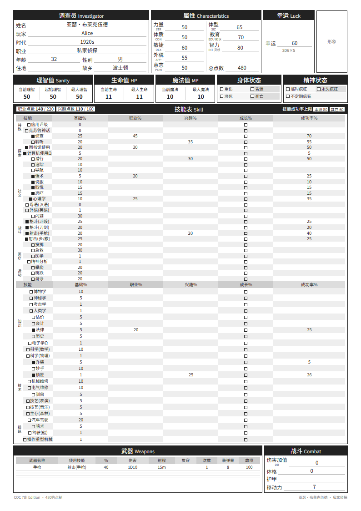
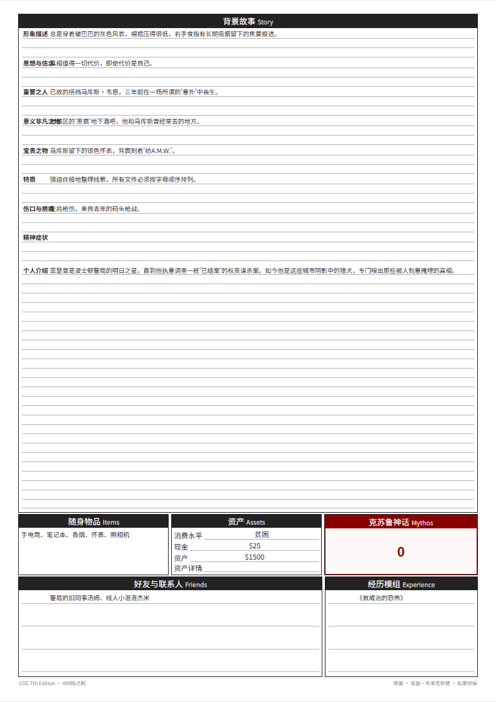

# COC Cardwright

> **Agent 生成角色概念 → CLI 严格校验 → 双面 A4 角色卡**

`coc-cardwright` 是克苏鲁的呼唤 7 版（Call of Cthulhu 7th Edition）480 购点制的角色卡生成工具。它由两部分组成：

- **Agent**（大模型/AI）：负责与用户对话，理解角色概念，生成分配合法的 JSON
- **CLI**（命令行工具）：负责规则校验、衍生属性计算、HTML 角色卡渲染

Agent 只管创意和分配，CLI 是唯一的规则权威（rule engine）。校验不通过，拒绝渲染。

---

## 效果预览

正面 | 背面
:--:|:--:
 | 

- **正面**：调查员信息 / 属性 / 幸运 / 头像占位 / 衍生属性（HP/MP/SAN/状态） / 技能双栏表 / 武器 / 战斗
- **背面**：背景故事（横线底纹，手写友好）/ 随身物品 / 资产 / 克苏鲁神话 / 好友 / 经历模组

浏览器打开 → 打印 → 选「双面打印」→ 得到标准 A4 角色卡。

---

## 安装

```bash
git clone https://github.com/yourname/coc-cardwright.git
cd coc-cardwright
pip install -e .
```

要求 Python 3.10+，依赖只有 Jinja2。

---

## CLI 命令速查

```bash
# 1. 查看所有职业（112 个）
coc jobs

# 2. 查看某个职业的详情（点数公式、本职技能、信用范围）
coc job "私家侦探"

# 3. 校验角色 JSON（Agent 生成后必须先过这关）
coc verify character.json

# 4. 生成 HTML 角色卡（校验不通过会拒绝）
coc render character.json -o card.html
```

---

## 详细用法

### `coc jobs` — 列出所有职业

输出 112 个职业名称的 JSON 数组。Agent 在引导用户选职业时可以先调这个命令获取列表。

```bash
$ coc jobs
[
  "业余艺术爱好者(原作向)",
  "中介调查员",
  "中高层管理人员",
  ...
]
```

### `coc job <职业名>` — 查看职业详情

Agent 用此命令获取职业的**点数公式**、**信用评级范围**和**本职技能列表**，从而生成分配合法的 JSON。

```bash
$ coc job "私家侦探"
{
  "name": "私家侦探",
  "formula_text": "教育×2 + (力量×2 或 敏捷×2)",
  "credit_range": "9~30",
  "occupation_skills": [
    "乔装", "侦查", "取悦", "图书馆使用", "射击(冲锋枪)",
    "射击(弓弩)", "射击(手枪)", ...
  ],
  "skill_description": "技艺(摄影)，乔装，法律，图书馆使用，心理学，侦查，..."
}
```

### `coc verify <json>` — 校验角色卡

Agent 生成 JSON 后，**必须**调用此命令校验。输出严格的校验报告：

```bash
$ coc verify detective.json
{
  "valid": true,
  "errors": [],
  "warnings": [],
  "derived": {
    "hp": 11,
    "mp": 10,
    "san": 50,
    "db": "0",
    "build": 0,
    "mov": 7,
    "dodge": 30,
    "native_language": 70,
    "pro_points_total": 220,
    "pro_points_used": 140,
    "pro_points_remaining": 80,
    "interest_points_total": 160,
    "interest_points_used": 110,
    "interest_points_remaining": 50
  }
}
```

如果校验失败，`valid` 为 `false`，`errors` 数组会给出每条违规的详细信息：

```json
{
  "valid": false,
  "errors": [
    {
      "code": "PRO_SKILL_NOT_OCCUPATION",
      "field": "skill_allocations.pro.医学",
      "expected": ["乔装", "侦查", ...],
      "actual": "医学",
      "message": "【医学】不是【私家侦探】的本职技能，职业点数不能投给该技能"
    }
  ]
}
```

每条 error 都有 `code`（机器可读）、`field`（字段路径）、`expected`（期望值）、`actual`（实际值）、`message`（人类可读）。Agent 可以自动解析并修正。

### `coc render <json> [-o output.html]` — 生成 HTML 角色卡

**必须先通过 `verify` 才能渲染**。生成双面 A4 HTML，浏览器打印即可。

```bash
$ coc render detective.json -o detective_card.html
角色卡已生成: /path/to/detective_card.html
```

HTML 特点：
- 精确 A4 尺寸（210mm × 297mm）
- 技能表左右双栏，50 个核心技能全展示，带斑马纹、分组竖排标签、本职技能复选框
- 背面背景故事带横线底纹，方便手写补充
- 状态栏（重伤/昏迷/濒死/死亡/临时疯狂/永久疯狂/不定期疯狂）带勾选框
- 武器成功率自动从对应技能计算

---

## Agent 工作流

Agent（大模型）只需要做三件事：

1. **对话**：引导用户描述角色概念（职业、性格、背景）
2. **查询**：调用 `coc job <职业>` 获取本职技能和点数公式
3. **生成**：输出符合 JSON Schema 的分配文件

Agent **不需要计算**：
- 技能初始值（CLI 从数据表读取）
- 职业点数上限（CLI 按公式计算）
- 兴趣点数上限（CLI 按 INT×2 计算）
- HP/MP/SAN/DB/体格/MOV/闪避/母语（CLI 自动算）

Agent **必须遵守**：
- 8 属性总和 = 480，每项 20~80
- 幸运 15~90（3D6×5），不含在 480 内
- 职业技能最终值 ≤ 80，兴趣技能最终值 ≤ 60
- 职业点数**只能**投给该职业的本职技能
- 兴趣点数可以投给**任何**技能
- 信用评级在职业允许的范围内
- 克苏鲁神话**禁止**分配点数

**推荐流程**：

```
1. 引导用户确定角色概念
2. 调用 coc job <职业名> → 获取点数公式、本职技能、信用范围
3. 生成 JSON 草稿
4. 调用 coc verify → 获取校验报告
5. 如有 errors，向用户说明并修正（或自动修正）
6. 重复 4-5 直到 valid: true
7. 调用 coc render → 获取 HTML 路径
8. 告诉用户：浏览器打开打印即可
```

---

## JSON 输入格式

```json
{
  "basic": {
    "name": "亚瑟·布莱克伍德",
    "player": "Alice",
    "job": "私家侦探",
    "age": 32,
    "gender": "男",
    "hometown": "波士顿",
    "era": "1920s"
  },
  "attributes": {
    "str": 50, "con": 50, "dex": 60, "app": 55,
    "pow": 50, "siz": 65, "edu": 70, "int": 80
  },
  "luck": 60,
  "credit_rating": 25,
  "skill_allocations": {
    "pro": {
      "侦查": 45,
      "图书馆使用": 30,
      "心理学": 25,
      "话术": 20,
      "法律": 20
    },
    "interest": {
      "潜行": 30,
      "聆听": 35,
      "锁匠": 25,
      "射击(手枪)": 20
    }
  },
  "weapons": [
    {
      "name": "手枪",
      "skill": "射击(手枪)",
      "damage": "1D10",
      "range": "15m",
      "attacks": 1,
      "ammo": 8,
      "malf": 100
    }
  ],
  "items": ["手电筒", "笔记本", "香烟", "怀表", "照相机"],
  "assets": {
    "cash": "$25",
    "consumption": "贫困",
    "assets": "$1500",
    "items": "一间狭小的公寓、一辆旧汽车"
  },
  "mythos": 0,
  "friends": "警局的旧同事汤姆、线人小混混杰米",
  "experienced_modules": "《敦威治的恐怖》",
  "background": {
    "appearance": "皱巴巴的灰色风衣...",
    "belief": "相信一切代价...",
    "important_person": "搭档马库斯·韦恩...",
    "important_place": "黑猫地下酒吧...",
    "important_item": "银色怀表...",
    "trait": "强迫症般地整理线索...",
    "scar": "码头枪战留下的疤...",
    "madness": "",
    "description": "波士顿警局的明日之星..."
  }
}
```

字段说明：

| 字段 | 必填 | 说明 |
|------|------|------|
| `basic` | ✅ | 姓名、玩家、职业、年龄、性别、故乡、时代 |
| `attributes` | ✅ | 8 项属性（str/con/dex/app/pow/siz/edu/int），总和 480，每项 20~80 |
| `luck` | ✅ | 15~90 |
| `credit_rating` | ✅ | 信用评级，必须在职业范围内 |
| `skill_allocations.pro` | ✅ | 职业点数分配，键为技能名，值为点数 |
| `skill_allocations.interest` | ✅ | 兴趣点数分配，键为技能名，值为点数 |
| `weapons` | ❌ | 武器列表，每项含 name/skill/damage/range/attacks/ammo/malf |
| `items` | ❌ | 随身物品字符串数组 |
| `assets` | ❌ | cash（现金）/ consumption（消费水平）/ assets（资产）/ items（资产详情） |
| `mythos` | ❌ | 克苏鲁神话值，默认 0 |
| `friends` | ❌ | 好友与联系人 |
| `experienced_modules` | ❌ | 经历模组 |
| `background` | ❌ | 8 个背景故事字段 + description（个人介绍） |

---

## 校验规则

CLI 是唯一的规则权威，校验不通过即报错，拒绝渲染 HTML。

| 校验项 | 规则 |
|--------|------|
| 属性总和 | 8 项属性必须严格等于 480 |
| 属性范围 | 每项 20~80 |
| 幸运 | 15~90 |
| 职业点数 | 按职业公式计算，不得超过上限 |
| 兴趣点数 | INT × 2，不得超过上限 |
| 职业技能上限 | 最终值（初始+职业点）≤ 80 |
| 兴趣技能上限 | 最终值（初始+兴趣点）≤ 60 |
| 本职技能 | 职业点数**只能**投给该职业的本职技能 |
| 克苏鲁神话 | **禁止**分配任何点数 |
| 信用评级 | 必须在职业允许的范围内 |

---

## 数据来源与致谢

- **职业/技能数据**：提取自 [trpg-saikou](https://github.com/masquevil/trpg-saikou)（侠小然），共 112 个职业、140 个技能
- **角色卡视觉设计**：参考 trpg-saikou 的 PaperSection 区块系统、双栏技能表、WritableArea 横线背景
- **规则计算**：参考 [cochar](https://github.com/ajwalkiewicz/cochar)（Adam Walkiewicz）

---

## 项目结构

```
coc-cardwright/
├── coc_generator/
│   ├── __init__.py
│   ├── __main__.py
│   ├── cli.py              # CLI 命令入口 (coc verify/render/jobs/job)
│   ├── engine.py           # 规则引擎：校验 + 衍生属性计算
│   ├── renderer.py         # HTML 渲染：技能分组、双栏、斑马纹
│   ├── schema.py           # 数据模型与校验结果格式
│   └── data/
│       ├── skills.py       # 140 技能定义（初始值、动态公式）
│       ├── jobs.py         # 112 职业定义（点数公式、本职技能）
│       └── templates/
│           └── card.html   # A4 双面角色卡模板
├── examples/
│   ├── detective.json      # 私家侦探示例
│   ├── archaeologist.json  # 考古学家示例
│   ├── doctor.json         # 医生示例
│   └── *_card.html         # 生成的角色卡
├── scripts/
│   └── extract_data.py     # 从 trpg-saikou 提取数据的脚本
├── README.md
└── pyproject.toml
```

---

## License

MIT
